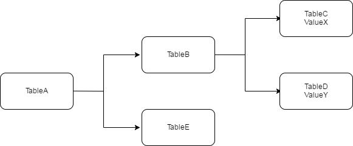
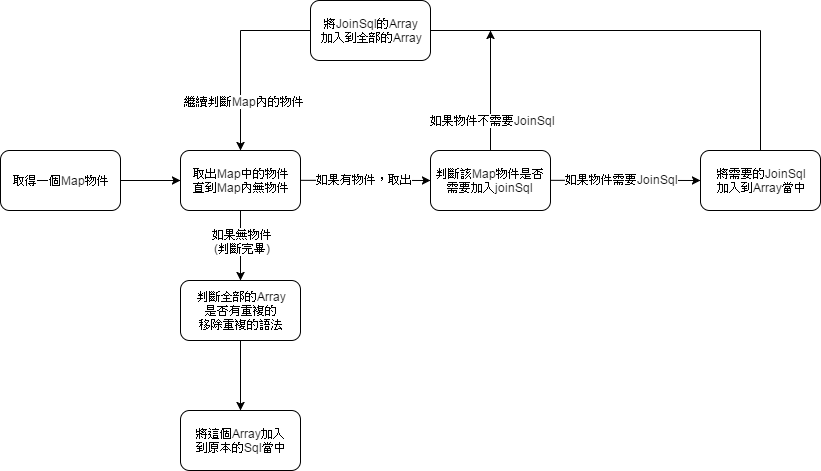

# DynameSql

# 說明

所謂的動態Join，其實是從動態Where延伸的。
在實作上，使用者會給予搜索條件，當需要什麼條件的時候，
才會加入語法去搜索。

那如果沒有呢？就不需要該條件。
譬如兩個欄位，一個Name，一個Sex，使用者只想找Name，這時候輸入Name
並不需要Sex的條件式。

所以語法就會變成Where Name=? ，不會有Where Sex=?；
如此一來即是動態產生。
這樣的好處是可以在資料量大的時候減少判斷的時間與增加效能。

但Join相對的複雜，Join本身是依據所需要的Where去判斷找到哪個資料表
而有時候正規劃如果做得相當細膩，就必須要Join大量的表格
可是，Join會有重複判斷的問題，譬如當使用者需要Name與Sex
假如Name在TableB，而Sex在TableC，他們同時依附於TableA，而TableA依附於MainTable
這時候，就必須要Join TableA.B.C近來，
如果只要Name，那就只要加入TableA與TableB。

所以在此以Jave後端配合資料庫做為解說，程式不一定只能用於動態JoinSql，
還有許多的用途，而這只是從動態Join所思考的一種方式。

***

# 原理

<ul>
<li>如果需要找到ValueX---Select TableA Join TableB Join TableC </li>
<li>如果需要找到ValueY---Select TableA Join TableB Join TableD </li>
<li>如果需要找到ValueX和ValueY---Select TableA Join TableB Join TableC Join TableD</li>
</ul>

在動態Sql的條件，需要ValueX的時候才會加入TableB與TableC；
需要ValueY的時候才會加入TableB與TableD

在判斷邏輯中，我使用Array加入每一行的Join語法，
並且利用Map判斷使用者是否需要該Value。

如此一來，程式會一一將Value取出來做判斷。

但是在判斷到ValueX的時候會加入TableB與TableC，
如果使用者又需要ValueY的時候會加入一次TableB與TableD，
這時候TableB會重覆，就必須要移除一個TableB的語法。

***

# 步驟

<ol>
<li>後端取得Map物件</li>
<li>一個一個取出Map的key，進行判斷</li>

<li>判斷該key是否需要Join：
	joinSql不一定只有一個，所以要用Array存放，會回傳一個Array。</li>

<li>判斷結束後將這個Array加入全部的Array中，直到Map空了。</li>

<li>接著把這個Array做判斷，判斷裡面的句子是否重複，重複就必須移除。</li>

<li>最後加入到Sql當中進行搜索。</li>
</ol>

***

# 實例

## 1.將Sql的join與where與拆出

    private static String querySql;
    static {
        StringBuilder sb = new StringBuilder();
        sb.append("SELECT *");
        sb.append("FROM clothes C \n");
        sb.append("--REPLACE_JOIN_SQL \n");
        sb.append("--REPLACE_WHERE_SQL \n");
 
        querySql = sb.toString();
    }

使用`StringBuilder` 可以分解字串，其中的`--REPLACE_JOIN_SQL`與`--REPLACE_WHERE_SQL`是之後要取代的部分。

***

## 2.將帶有條件的Map傳入判斷

這部分要拆解來看。

    public String genJoinSql(final String sql, Map<String, Object> queryMap) {
    	String _sql = new String(sql);
    	LinkedList<String> allJoinSqlList = new LinkedList<String>();

    	for(String key : queryMap.keySet()){
		    Object value = queryMap.get(key);
		    if(!getJoinResultMap(queryMap,key).equals("") && (value != null) && (!"".equals(value))){
		    	
		    	LinkedList<String> joinResult = getJoinResultMap(queryMap,key);
		    	for(int i=joinResult.size()-1; i>=0;i--){
		    		allJoinSqlList.addFirst(joinResult.get(i));
		    	}

		    }
	    }
	     
    	if(allJoinSqlList.size()!=0){
    		return  _sql.replaceAll("--REPLACE_JOIN_SQL", isNotRepeat(allJoinSqlList));
    	}else{
    		return  _sql.replaceAll("--REPLACE_JOIN_SQL", "");
    	}
    }
 
 

首先，要先將剛才的sql傳進來，並且給予一個`LinkedList<String>`來接收結果，
看到程式判斷，會呼叫`getJoinResultMap`方法去判斷是否要加入join。

程式中經過判斷後，會回傳Array，也就是當Value會先判斷需要什麼JoinSql，並且一行一行加入到整個Array內。

   	for(String key : queryMap.keySet()){
		    Object value = queryMap.get(key);
		    if(!getJoinResultMap(queryMap,key).equals("") && (value != null) && (!"".equals(value))){
		    	
		    	LinkedList<String> joinResult = getJoinResultMap(queryMap,key);
		    	for(int i=joinResult.size()-1; i>=0;i--){
		    		allJoinSqlList.addFirst(joinResult.get(i));
		    	}

		    }
	    }

***

`getJoinResultMap`方法是將剛才的map傳遞近來，並用case判定這個Value是否需要加入JoinSql。

JoinSql有時候不只一個，而且有順序問題，所以一樣要用`LinkedList`比較好，接著回傳判斷好的Array。

    private LinkedList<String> getJoinResultMap(Map<String, Object> queryMap , String queryObject){
    	
    	LinkedList<String>builderArray =  new LinkedList<String>();
    	
	    	Object value = queryMap.get(queryObject);
	    	switch (queryObject) {
				case "mapValue":
					
					if(value!=null){
						builderArray.add("Join Sql 1");	
            builderArray.add("Join Sql 2");	
					}					
					break;
				
			}
    	return builderArray;
    }
    

***

判斷結束後，Array會有非常多的JoinSql，這時候可能會有重複的問題。

這邊邏輯層原理是要依照順序的，因為Sql中的Join語法在判斷時會有順位問題。

所以我使用While迴圈，並且用`LinkedList`，這樣就可以確保順序問題。

邏輯的概論就是，每次都取得第一個去跟其他的判斷是否重複，並且移除掉這一個，
詳細原理與中序轉後序的演算法差不多。

然後最後要把語法全部加入進去到原本的Sql即可完成。

      private String isNotRepeat(LinkedList<String> allJoinSqlList){

        LinkedList<String> newbuilder = new LinkedList<String>();

        do {
          String first = allJoinSqlList.getFirst();
            allJoinSqlList.removeFirst();	
            for(int i=0; i<allJoinSqlList.size();i++){
                if(first.equals(allJoinSqlList.get(i))){
                  allJoinSqlList.remove(i);
                }
            }
          newbuilder.add(first);

      } while (!allJoinSqlList.isEmpty());

       StringBuilder sb = new StringBuilder();

        for(int j=0; j<newbuilder.size();j++){

          if(j==(newbuilder.size()-1)){
            String lastsb = newbuilder.get(j).replace("\n", "");
            sb.append(lastsb);
          }else{
            sb.append(newbuilder.get(j));
          }
        }

        return sb.toString();
      }
    
***

# 比較

其實動態Sql的好處在於，不會有一大串的Sql指令下到資料庫，

但是這等於是在程式上就需要多做判斷才可以，
所以通常是在Sql語法特別長，搜索條件非常多的時候才會使用。

所以要斟酌考量是否每次都需要動態使用。

<table>
    <tr>
        <td>比較對象</td>
	<td>傳統Sql</td>
	<td>動態Sql</td>
    </tr>
    <tr>
    <td>閱讀性</td>
	  <td>較差</td>
	  <td>較佳</td>
    </tr>
    <tr>
     <td>對系統效能</td>
	    <td>較佳</td>
	    <td>較差</td>
    </tr>
    <tr>
     <td>對資料庫效能</td>
	    <td>較差</td>
	    <td>較佳</td>
    </tr> 
</table>

***

# 總結

雖然是動態Sql，但是其實有很多地方可以運用，

當然，這樣的寫法並不是很好，太吃效能，好處是可以大量的加入字串並且排除重複。

邏輯層的方面因為受限於JoinSql有順序問題而變得很麻煩，

但是如果能夠運用，我覺得可以運用在更多地方，而這只是以動態Join作為出發點而已。
